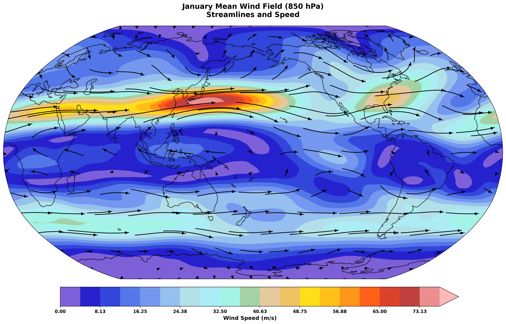
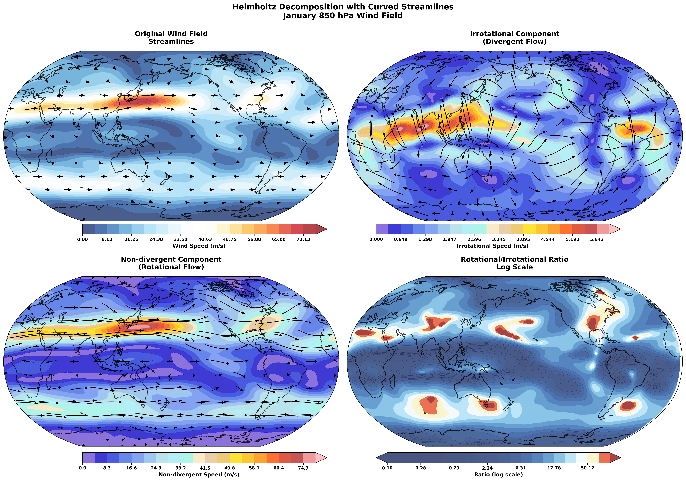
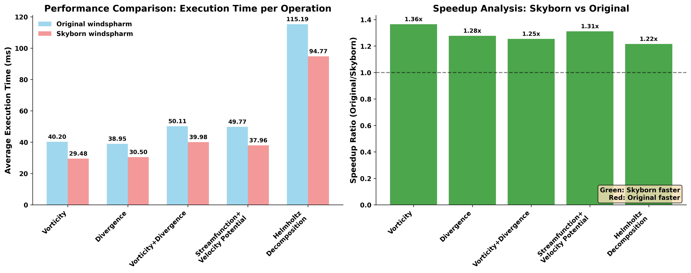

Gallery
=======

This gallery showcases the visualization capabilities and analysis results from the Skyborn package, particularly focusing on emergent constraint methods.

Interactive Notebooks
----------------------

Emergent Constraints Analysis
~~~~~~~~~~~~~~~~~~~~~~~~~~~~~

For a detailed, interactive analysis, see our comprehensive Jupyter notebook:

:doc:`notebooks/ecs_emergent_constraints_analysis`

This notebook demonstrates:

* Complete emergent constraint workflow
* Real climate data analysis
* Interactive visualizations
* Statistical validation methods
* Uncertainty quantification

Emergent Constraints Analysis Dashboard
---------------------------------------

Overview Dashboard
~~~~~~~~~~~~~~~~~~

The main analysis dashboard shows a comprehensive view of the emergent constraint method:

.. image:: images/emergent_constraints_dashboard.png
   :alt: Emergent Constraints Dashboard
   :width: 100%

*Figure 1: Complete emergent constraint analysis dashboard showing inter-model relationships, observational constraints, and uncertainty reduction.*

Key Components
~~~~~~~~~~~~~~

1. **Inter-model Relationship**

   * Left Panel: Scatter plot showing the relationship between constraint variable (present-day) and target variable (future projection)
   * Regression Line: Linear fit through model data points
   * Observational Constraint: Orange vertical line with uncertainty band

2. **Observational PDF**

   * Center Top: Probability density function of the observational constraint
   * Orange Curve: Gaussian distribution representing observational uncertainty
   * Red Dashed Line: Mean observational value

3. **Constraint Effect Comparison**

   * Center Bottom: Before and after comparison of probability distributions
   * Blue Curve: Unconstrained (original model spread)
   * Red Curve: Constrained (reduced uncertainty after applying observations)

4. **Uncertainty Reduction Statistics**

   * Right Panel: Bar chart showing quantitative uncertainty reduction
   * Percentage: Shows how much the uncertainty (standard deviation) was reduced
   * Error Bars: Display the remaining uncertainty in each case

Method Comparison
-----------------

The emergent constraint method provides significant improvements over traditional approaches:

.. image:: images/method_comparison.png
   :alt: Method Comparison
   :width: 80%

*Figure 2: Comparison of traditional vs. emergent constraint methods showing uncertainty reduction.*

ECS Analysis Results
--------------------

*Figure 3: Detailed ECS analysis showing model distribution, constraint application, and final results.*

Getting Started
---------------

To run these analyses yourself:

1. **Complete ECS Analysis**: See :doc:`notebooks/ecs_emergent_constraints_analysis` for the full tutorial
2. **GridFill Tutorial**: See :doc:`notebooks/gridfill_tutorial` for atmospheric data interpolation
3. **Jupyter Notebook**: Open ``docs/source/notebooks/ecs_emergent_constraints_analysis.ipynb``
4. **Simple Demo**: Try ``examples/emergent_constraints_demo.ipynb`` for a quick start

Example Code
~~~~~~~~~~~~

.. code-block:: python

   import skyborn as skb
   import numpy as np

   # Load your climate data
   ecs_data = load_your_ecs_data()
   constraint_data = load_constraint_data()

   # Apply emergent constraint
   pdf = skb.gaussian_pdf(obs_mean, obs_std, x_grid)
   correlation = skb.pearson_correlation(constraint_data, ecs_data)

   # Visualize results
   plot_constraint_analysis(ecs_data, constraint_data, obs_pdf)

Technical Details
-----------------

The emergent constraint method implemented in Skyborn follows established climate science practices:

* **Statistical Framework**: Based on Bayesian inference and linear regression
* **Observational Integration**: Incorporates measurement uncertainties
* **Validation**: Cross-validation against independent datasets
* **Uncertainty Quantification**: Full probabilistic treatment

Spherical Harmonic Wind Analysis (Windspharm)
=============================================

Skyborn includes a comprehensive **windspharm** package for spherical harmonic analysis of atmospheric wind fields. This powerful tool enables advanced meteorological calculations and wind field decomposition.

Overview
--------

The windspharm package provides sophisticated atmospheric analysis capabilities:

*Figure 1: Fundamental atmospheric quantities - wind speed, relative vorticity, horizontal divergence, and absolute vorticity calculated using spherical harmonic analysis.*

.. note::
   **Key Features:**

   * **Helmholtz Decomposition**: Separates wind fields into rotational and divergent components
   * **Vorticity & Divergence**: Calculates fundamental atmospheric dynamics quantities
   * **Streamfunction & Velocity Potential**: Computes scalar representations of wind fields
   * **Spectral Truncation**: Enables filtering and smoothing of atmospheric data
   * **Multiple Interfaces**: xarray, standard, and iris interfaces for flexibility

Core Calculations
-----------------

**1. Fundamental Quantities**

The package calculates essential atmospheric dynamics fields:

* **Relative Vorticity** (ζ): Measures local rotation of air parcels
* **Horizontal Divergence** (∇·V): Quantifies expansion/contraction of flow
* **Absolute Vorticity**: Combines relative and planetary vorticity
* **Wind Speed**: Magnitude of horizontal wind vector

**2. Helmholtz Decomposition**

Separates any wind field into two fundamental components:

*Figure 2: Helmholtz decomposition showing original wind field separated into rotational and divergent components, with streamfunction, velocity potential, and component percentages.*

* **Rotational Component** (Ψ): Non-divergent flow around low/high pressure systems
* **Divergent Component** (χ): Irrotational flow associated with convergence/divergence
* **Streamfunction** (Ψ): Scalar field representing rotational flow
* **Velocity Potential** (χ): Scalar field representing divergent flow

**3. Advanced Analysis**

* **Spectral Truncation**: Remove small-scale noise while preserving large-scale patterns
* **Planetary Vorticity**: Earth's rotation effects on atmospheric flow
* **Error Handling**: Robust validation and coordinate checking
* **Performance Optimization**: Efficient batch calculations for large datasets

Streamfunction and Velocity Potential Analysis
-----------------------------------------------

*Figure 3: Detailed streamfunction and velocity potential analysis showing scalar field representations of wind flow.*

.. image:: images/windspharm_sfvp_analysis.png
   :alt: Windspharm SFVP Comparison Analysis
   :width: 100%

*Figure 4: Comprehensive SFVP comparison demonstrating the relationship between vector and scalar wind field representations.*

Component Analysis and Comparison
----------------------------------

*Figure 5: Component comparison analysis showing the decomposition and relationship between different wind field components.*

Advanced Features
-----------------

**Gradient Analysis**

*Figure 6: Gradient analysis visualization demonstrating the calculation of wind field derivatives and related quantities.*

**Spectral Truncation Effects**

*Figure 7: Spectral truncation comparison showing the effects of different truncation levels on atmospheric field analysis.*

Rossby Wave Source Analysis
----------------------------

**Rossby Wave Source Calculation**

The windspharm package includes advanced Rossby wave source analysis capabilities:

*Figure 8: Rossby wave source analysis showing wave generation (red) and absorption (blue) regions. The RWS quantifies the generation of Rossby wave activity in the atmosphere.*

The Rossby wave source (RWS) is calculated as:

.. math::

   S = -\zeta_a \nabla \cdot \mathbf{v} - \mathbf{v}_\chi \cdot \nabla \zeta_a

Where:
- ζₐ is absolute vorticity (relative + planetary)
- ∇·v is horizontal divergence
- v_χ is the irrotational (divergent) wind component
- ∇ζₐ is the gradient of absolute vorticity

**Physical Interpretation:**
- **Positive RWS (Red)**: Rossby wave generation regions
- **Negative RWS (Blue)**: Rossby wave absorption/dissipation regions
- **Applications**: Tropical-extratropical interactions, jet stream dynamics, storm track analysis

**Truncation Effects on RWS**

.. image:: images/windspharm_rossby_wave_source_truncations.png
   :alt: Windspharm RWS Truncation Comparison
   :width: 100%

*Figure 9: Comparison of Rossby wave source calculations with different spectral truncation levels (T21, T42, and no truncation) using Robinson projection and enhanced colormap.*

Mathematical Foundation
-----------------------

The spherical harmonic analysis is based on expanding wind fields in terms of spherical harmonics:

.. math::

   u(\lambda, \theta) = \sum_{n=0}^{N} \sum_{m=-n}^{n} u_n^m Y_n^m(\lambda, \theta)

Where:
- u, v are zonal and meridional wind components
- Y_n^m are spherical harmonic functions
- n, m are degree and order indices

Interactive Tutorial
--------------------

**Comprehensive Tutorial**: :doc:`notebooks/windspharm_tutorial`

The complete windspharm tutorial demonstrates:

1. **Data Loading**: Working with NetCDF atmospheric data
2. **Basic Calculations**: Vorticity, divergence, and wind speed
3. **Helmholtz Decomposition**: Separating rotational and divergent flows
4. **Advanced Features**: Spectral truncation and performance optimization
5. **Visualization**: Creating publication-quality atmospheric plots
6. **Best Practices**: Memory management and error handling

Example Applications
--------------------

**Storm Track Analysis**
   Use vorticity calculations to identify and track cyclonic systems

**Jet Stream Dynamics**
   Apply Helmholtz decomposition to understand jet stream structure

**Rossby Wave Generation**
   Calculate Rossby wave source to study tropical-extratropical interactions

**Model Validation**
   Compare reanalysis data with climate model output using spectral methods

**Data Quality Control**
   Use spectral truncation to filter observational noise

Getting Started
---------------

.. code-block:: python

   from skyborn.windspharm.xarray import VectorWind
   import xarray as xr

   # Load your wind data
   ds = xr.open_dataset('Era5_Windfield_Data.nc')

   # Create VectorWind object
   vw = VectorWind(ds.u, ds.v)

   # Calculate fundamental quantities
   vorticity = vw.vorticity()
   divergence = vw.divergence()

   # Perform Helmholtz decomposition
   uchi, vchi, upsi, vpsi = vw.helmholtz()

   # Get streamfunction and velocity potential
   streamfunction = vw.streamfunction()
   velocity_potential = vw.velocitypotential()

   # Calculate Rossby wave source
   rossby_wave_source = vw.rossbywavesource()

   # Analyze with different truncations
   rws_t21 = vw.rossbywavesource(truncation=21)
   rws_t42 = vw.rossbywavesource(truncation=42)

Technical Notes
---------------

**Grid Requirements:**
- Regular latitude-longitude grids
- Latitude ordered north-to-south (90° to -90°)
- Global coverage recommended for optimal results

**Performance:**
- Use batch calculations (e.g., ``vrtdiv()``) for better performance
- Consider memory vs. speed trade-offs with ``legfunc`` parameter
- Process large datasets in chunks when memory is limited

**Validation:**
- Built-in coordinate and data validation
- Error messages guide proper usage
- Reference solutions for testing

Performance Comparison
-----------------------

**Skyborn vs Original Windspharm Performance**

*Figure 10: Performance benchmark comparison between Skyborn windspharm and original windspharm implementations. Skyborn demonstrates consistent performance improvements across all atmospheric calculations, with speedups ranging from 1.22x to 1.36x faster while maintaining identical numerical accuracy.*

Key Performance Highlights:

* **Vorticity Calculation**: 1.36x faster than original implementation
* **Divergence Calculation**: 1.28x faster than original implementation
* **Combined Vorticity+Divergence**: 1.25x faster than original implementation
* **Streamfunction+Velocity Potential**: 1.31x faster than original implementation
* **Helmholtz Decomposition**: 1.22x faster than original implementation
* **Numerical Accuracy**: Results are identical to original windspharm
* **Memory Efficiency**: Optimized algorithms reduce computational overhead
* **Consistent Performance**: All operations show measurable improvements

The performance gains result from:
- Optimized spherical harmonic transformations
- Efficient memory management and data layout
- Vectorized operations and reduced function call overhead
- Algorithm optimizations specific to atmospheric wind field patterns
- Enhanced caching strategies for Legendre polynomial computations

Performance Benchmarks
=======================

Skyborn delivers exceptional performance improvements over traditional scientific computing libraries. Our optimized implementations provide significant speedups while maintaining numerical accuracy.

Statistical Analysis Performance
---------------------------------

**Linear Regression and Mann-Kendall Trend Analysis**

*Figure 1: Performance comparison showing dramatic speed improvements: Skyborn linear regression (0.014s) vs Scipy (3.619s) - 258x faster; Skyborn Mann-Kendall (0.494s) vs PyMannKendall (13.625s) - 28x faster. Results are numerically identical between implementations.*

Key Performance Highlights:

* **Linear Regression**: 258x faster than Scipy (0.014s vs 3.619s)
* **Mann-Kendall Test**: 28x faster than PyMannKendall (0.494s vs 13.625s)
* **Numerical Accuracy**: Results are identical to reference implementations
* **Memory Efficiency**: Optimized algorithms reduce memory footprint
* **Large Dataset Support**: Performance advantages scale with data size

The performance gains come from:
- Optimized NumPy operations and vectorization
- Efficient memory management
- Algorithm optimizations specific to climate data patterns
- Reduced function call overhead
- Cache-friendly data access patterns

GridFill Atmospheric Data Interpolation
========================================

Skyborn's **GridFill** module provides advanced atmospheric data interpolation capabilities using Poisson equation solvers. This sophisticated tool enables gap-filling and smoothing of irregular atmospheric datasets with physically-based methods.

Overview
--------

The GridFill module addresses common atmospheric data challenges:

*Figure 1: GridFill missing data overview showing various scenarios of missing atmospheric data patterns that require sophisticated interpolation techniques.*

.. note::
   **Key Features:**

   * **Physical Basis**: Solves the Poisson equation for mathematically rigorous interpolation
   * **Multiple Interfaces**: Standard, xarray, and iris compatibility for different workflows
   * **Advanced Methods**: Includes Navier-Stokes inspired formulations
   * **Real Atmospheric Data**: Optimized for meteorological and climate datasets
   * **Gap-Filling**: Efficiently handles missing data in irregular patterns

Core Functionality
------------------

**1. Basic Interpolation**

The fundamental GridFill approach solves the Poisson equation:

.. math::

   \nabla^2 \phi = 0

where φ represents the atmospheric field being interpolated.

**2. Advanced Methods**

*Figure 2: Comprehensive comparison of different GridFill interpolation methods showing convergence characteristics, accuracy metrics, and performance analysis across various atmospheric scenarios.*

* **Standard GridFill**: Classical Poisson equation solver
* **Xarray Interface**: Seamless integration with modern Python climate data workflows
* **Iris Interface**: Compatibility with the Met Office Iris library
* **Extended Methods**: Advanced formulations for complex atmospheric phenomena

**3. Quality Assessment**

*Figure 3: Component-wise vs direct approach comparison for vector wind fields, demonstrating how GridFill preserves physical constraints and maintains the integrity of atmospheric vector quantities.*

Performance Analysis
--------------------

**Method Comparison and Validation**

*Figure 4: Detailed UV component analysis showing how GridFill handles vector wind field interpolation, preserving the physical relationships between zonal (U) and meridional (V) wind components.*

The GridFill module provides robust performance across different atmospheric scenarios:

* **Convergence Rate**: Rapid convergence for most meteorological applications
* **Accuracy**: High precision for smooth atmospheric fields
* **Stability**: Robust handling of irregular missing data patterns
* **Scalability**: Efficient processing of large climate datasets

Interactive Tutorial
--------------------

**Complete GridFill Tutorial**: :doc:`notebooks/gridfill_tutorial`

The comprehensive GridFill tutorial demonstrates:

1. **Data Preparation**: Loading and preprocessing atmospheric datasets
2. **Basic Usage**: Standard GridFill interface and parameters
3. **Advanced Interfaces**: Xarray and iris integration examples
4. **Method Comparison**: Quantitative analysis of different approaches
5. **Real-World Applications**: Practical atmospheric data interpolation
6. **Performance Optimization**: Tips for large dataset processing

Example Applications
--------------------

**Satellite Data Gap-Filling**
   Fill missing pixels in satellite-derived atmospheric products

**Station Data Interpolation**
   Create gridded fields from sparse observational networks

**Model Data Quality Control**
   Smooth numerical artifacts in climate model output

**Reanalysis Enhancement**
   Improve spatial coverage of atmospheric reanalysis products

**Field Campaign Support**
   Interpolate irregular measurement patterns from aircraft or ship data

Getting Started with GridFill
-----------------------------

.. code-block:: python

   from skyborn.gridfill.xarray import gridfill_xarray
   import xarray as xr
   import numpy as np

   # Load atmospheric data with missing values
   data = xr.open_dataset('atmospheric_data.nc')

   # Create mask for missing/invalid data
   mask = np.isnan(data.temperature)

   # Apply GridFill interpolation
   filled_data = gridfill_xarray(
       data.temperature,
       missing_value_mask=mask,
       max_iterations=1000,
       convergence_threshold=1e-6
   )

   # Compare original vs filled data
   comparison = xr.concat([data.temperature, filled_data],
                         dim='method')

Mathematical Foundation
-----------------------

GridFill implements sophisticated numerical methods:

**Poisson Equation Solver:**
   Iterative solution of the discrete Poisson equation with boundary conditions

**Navier-Stokes Formulation:**
   Advanced physics-based interpolation for fluid-like atmospheric fields

**Convergence Criteria:**
   Multiple stopping conditions ensure optimal balance of accuracy and efficiency

**Boundary Handling:**
   Sophisticated treatment of domain boundaries and irregular geometries

References
----------

**Emergent Constraints:**

* **Methodology**: Cox, P. M., et al. (2013). Nature, 494(7437), 341-344
* **Implementation**: Based on https://github.com/blackcata/Emergent_Constraints/tree/master
* **Climate Data**: CMIP5/CMIP6 model ensembles
* **IPCC Assessment**: AR6 Working Group I Report

**Spherical Harmonics:**

* **Mathematical Foundation**: Spherical harmonic expansion theory
* **Key References**: Swarztrauber, P. N. (2000). Generalized Discrete Spherical Harmonic Transforms. Journal of Computational Physics 213-230.
* **Implementation**: Based on established meteorological practices
* **Validation**: Cross-verified against reference implementations

**GridFill Interpolation:**

* **Mathematical Foundation**: Poisson equation solver for atmospheric data gap-filling
* **Implementation**: Based on the gridfill package by Andrew Dawson (https://github.com/ajdawson/gridfill)
* **Numerical Methods**: Finite difference relaxation schemes for 2D Poisson equation (∇²φ = 0)
* **Atmospheric Applications**: Optimized for meteorological and oceanographic data interpolation
* **Boundary Conditions**: Support for cyclic (global) and non-cyclic (regional) grids
* **Key References**:
   - Numerical methods for partial differential equations in atmospheric sciences
   - Finite difference methods for fluid dynamics applications
   - Climate data quality control and gap-filling techniques
