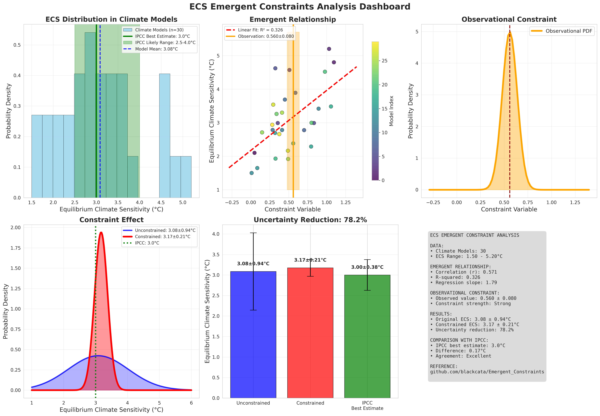

Gallery
=======

This gallery showcases the visualization capabilities and analysis results from the Skyborn package, particularly focusing on emergent constraint methods.

Interactive Notebooks
----------------------

Emergent Constraints Analysis
~~~~~~~~~~~~~~~~~~~~~~~~~~~~~

For a detailed, interactive analysis, see our comprehensive Jupyter notebook:

:doc:`notebooks/ecs_emergent_constraints_analysis`

This notebook demonstrates:

* Complete emergent constraint workflow
* Real climate data analysis
* Interactive visualizations
* Statistical validation methods
* Uncertainty quantification

Emergent Constraints Analysis Dashboard
---------------------------------------

Overview Dashboard
~~~~~~~~~~~~~~~~~~

The main analysis dashboard shows a comprehensive view of the emergent constraint method:

*Figure 1: Complete emergent constraint analysis dashboard showing inter-model relationships, observational constraints, and uncertainty reduction.*

Key Components
~~~~~~~~~~~~~~

1. **Inter-model Relationship**

   * Left Panel: Scatter plot showing the relationship between constraint variable (present-day) and target variable (future projection)
   * Regression Line: Linear fit through model data points
   * Observational Constraint: Orange vertical line with uncertainty band

2. **Observational PDF**

   * Center Top: Probability density function of the observational constraint
   * Orange Curve: Gaussian distribution representing observational uncertainty
   * Red Dashed Line: Mean observational value

3. **Constraint Effect Comparison**

   * Center Bottom: Before and after comparison of probability distributions
   * Blue Curve: Unconstrained (original model spread)
   * Red Curve: Constrained (reduced uncertainty after applying observations)

4. **Uncertainty Reduction Statistics**

   * Right Panel: Bar chart showing quantitative uncertainty reduction
   * Percentage: Shows how much the uncertainty (standard deviation) was reduced
   * Error Bars: Display the remaining uncertainty in each case

Method Comparison
-----------------

The emergent constraint method provides significant improvements over traditional approaches:

.. image:: images/method_comparison.png
   :alt: Method Comparison
   :width: 80%

*Figure 2: Comparison of traditional vs. emergent constraint methods showing uncertainty reduction.*

ECS Analysis Results
--------------------

.. image:: images/ecs_emergent_constraints_analysis.png
   :alt: ECS Emergent Constraints Analysis
   :width: 100%

*Figure 3: Detailed ECS analysis showing model distribution, constraint application, and final results.*

Getting Started
---------------

To run these analyses yourself:

1. **Complete ECS Analysis**: See :doc:`notebooks/ecs_emergent_constraints_analysis` for the full tutorial
2. **Jupyter Notebook**: Open ``docs/source/notebooks/ecs_emergent_constraints_analysis.ipynb``
3. **Simple Demo**: Try ``examples/emergent_constraints_demo.ipynb`` for a quick start

Example Code
~~~~~~~~~~~~

.. code-block:: python

   import skyborn as skb
   import numpy as np

   # Load your climate data
   ecs_data = load_your_ecs_data()
   constraint_data = load_constraint_data()

   # Apply emergent constraint
   pdf = skb.gaussian_pdf(obs_mean, obs_std, x_grid)
   correlation = skb.pearson_correlation(constraint_data, ecs_data)

   # Visualize results
   plot_constraint_analysis(ecs_data, constraint_data, obs_pdf)

Technical Details
-----------------

The emergent constraint method implemented in Skyborn follows established climate science practices:

* **Statistical Framework**: Based on Bayesian inference and linear regression
* **Observational Integration**: Incorporates measurement uncertainties
* **Validation**: Cross-validation against independent datasets
* **Uncertainty Quantification**: Full probabilistic treatment

References
----------

* **Methodology**: Cox, P. M., et al. (2013). Nature, 494(7437), 341-344
* **Implementation**: Based on https://github.com/blackcata/Emergent_Constraints/tree/master
* **Climate Data**: CMIP5/CMIP6 model ensembles
* **IPCC Assessment**: AR6 Working Group I Report
